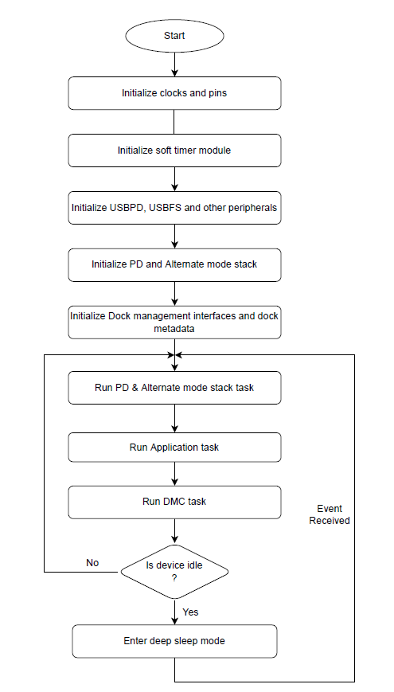
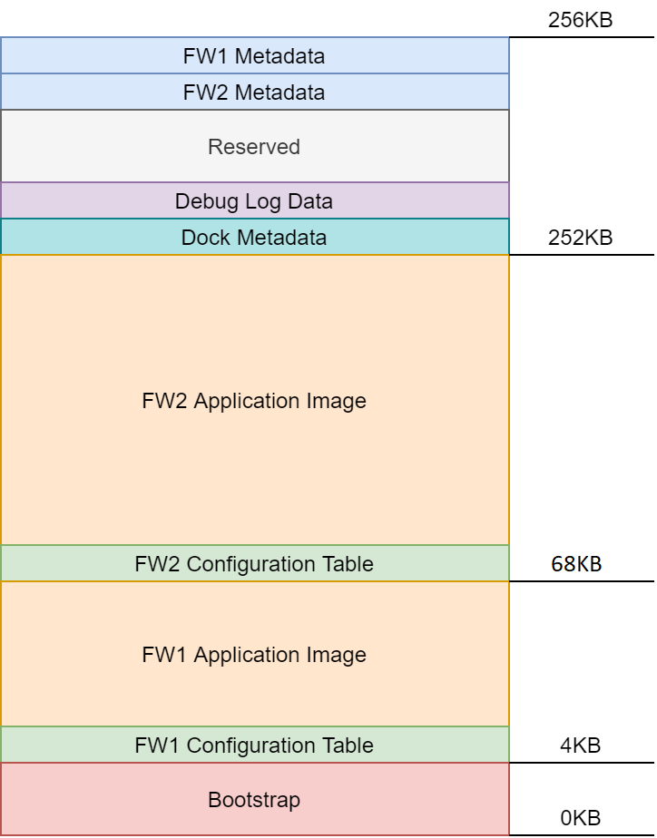

# EZ-PD&trade; PMG1-S3 USB-C dock solution

This dock solution provides firmware for USB-C dock design with EZ-PD&trade; PMG1S3 MCU.

The following features are supported by the EZ-PD&trade; PMG1S3 USB-C dock solution:

1. Type-C port configuration and connection detection in Sink, Source, and Dual-role on Port 0 and Source role on Port 1

2. USB PD communication compliant with USB PD Revision 3.1 Version 1.8 specification

3. Extended Power Range (EPR) support of 140 W in Source role on Port 0

4. Support for VESA DisplayPort Alt mode on Type-C Standard Version 1.0, which is compatible with DisplayPort specifications 1.3 and 1.4

5. USBFS device support (Vendor, HID and Billboard classes)

6. Support for power protections such as the following:
    - VBUS overvoltage protection (VBUS OVP)
    - VBUS overcurrent protection (VBUS OCP)
    - VBUS short-circuit protection (VBUS SCP)
    - VBUS undervoltage protection (VBUS UVP)
    - VCONN overcurrent protection (VCONN OCP)

7. Dock Management Controller (DMC) features such as:
   - Signed/unsigned offline firmware update for EZ-PD&trade; PMG1-S3 and onboard component such as EZ-PD&trade; CCG7SC controllers
   - Smart power management
   - Supports storing and retrieving ETAG information (e.g., device serial number, MAC ID)

8. Drivers for MP4247 buck-boost controllers from Monolithic Power Systems and RichTek6190 regulators from Ricktek Technology

9. Host Processor Interface (HPI) master implementation for communication with EZ-PD&trade; CCG7SC slave devices

10. UART and internal flash logging mechanism for debugging

11. LED control (e.g., ON, OFF, Blink, Breath) driver for custom use cases in the dock design

12. Adapter detection logic

13. Deep sleep operation


[View this README on GitHub.](https://github.com/Infineon/mtb-example-pmg1s3-usbc-dock)

[Provide feedback on this code example.](https://cypress.co1.qualtrics.com/jfe/form/SV_1NTns53sK2yiljn?Q_EED=eyJVbmlxdWUgRG9jIElkIjoiQ0UyMzk0MDAiLCJTcGVjIE51bWJlciI6IjAwMi0zOTQwMCIsIkRvYyBUaXRsZSI6IkVaLVBEJnRyYWRlOyBQTUcxLVMzIFVTQi1DIGRvY2sgc29sdXRpb24iLCJyaWQiOiJqYXl0IiwiRG9jIHZlcnNpb24iOiIxLjAuMCIsIkRvYyBMYW5ndWFnZSI6IkVuZ2xpc2giLCJEb2MgRGl2aXNpb24iOiJNQ0QiLCJEb2MgQlUiOiJXSVJFRCIsIkRvYyBGYW1pbHkiOiJUWVBFLUMifQ==)


## Requirements

- [ModusToolbox&trade; software](https://www.infineon.com/modustoolbox) v3.1 or later (tested with v3.1)
- Board support package (BSP) minimum required version: 3.0.0
- Programming language: C
- Associated parts: [EZ-PD&trade; PMG1S3 MCU](https://www.infineon.com/PMG1)


## Supported toolchains (make variable 'TOOLCHAIN')

- GNU Arm&reg; Embedded Compiler v11.3.1 (`GCC_ARM`) – Default value of `TOOLCHAIN`


## Supported hardware

This code example is developed to work with the EZ-PD&trade; PMG1-S3 USB-C dock board.

> **Note:** See the schematics of the [PMG1-S3 USB-C dock board](https://www.infineon.com/pmg1s3dock) for more details.

## Hardware setup

This example uses the board's default configuration. See the kit user guide to ensure that the board is configured correctly.

## Software setup

See the [ModusToolbox&trade; tools package installation guide](https://www.infineon.com/ModusToolboxInstallguide) for information about installing and configuring the tools package.

Install a terminal emulator if you don't have one. Instructions in this document use [Tera Term](https://teratermproject.github.io/index-en.html).

This example requires EZ-PD&trade; Dock Tools. See [EZ-PD&trade; Dock Tools](https://softwaretools.infineon.com/welcome) for more details.

## Using the code example

### Create the project

The ModusToolbox&trade; tools package provides the Project Creator as both a GUI tool and a command line tool.

<details><summary><b>Use Project Creator GUI</b></summary>

1. Open the Project Creator GUI tool.

   There are several ways to do this, including launching it from the dashboard or from inside the Eclipse IDE. For more details, see the [Project Creator user guide](https://www.infineon.com/ModusToolboxProjectCreator) (locally available at *{ModusToolbox&trade; install directory}/tools_{version}/project-creator/docs/project-creator.pdf*).

2. On the **Choose Board Support Package (BSP)** page, select a kit supported by this code example. See [Supported hardware](#supported-hardware).

   > **Note:** To use this code example for a kit not listed here, you may need to update the source files. If the kit does not have the required resources, the application may not work.

3. On the **Select Application** page:

   a. Select the **Applications(s) Root Path** and the **Target IDE**.

   > **Note:** Depending on how you open the Project Creator tool, these fields may be pre-selected for you.

   b.	Select this code example from the list by enabling its check box.

   > **Note:** You can narrow the list of displayed examples by typing in the filter box.

   c. (Optional) Change the suggested **New Application Name** and **New BSP Name**.

   d. Click **Create** to complete the application creation process.

</details>

<details><summary><b>Use Project Creator CLI</b></summary>

The 'project-creator-cli' tool can be used to create applications from a CLI terminal or from within batch files or shell scripts. This tool is available in the *{ModusToolbox&trade; install directory}/tools_{version}/project-creator/* directory.

Use a CLI terminal to invoke the 'project-creator-cli' tool. On Windows, use the command-line 'modus-shell' program provided in the ModusToolbox&trade; installation instead of a standard Windows command-line application. This shell provides access to all ModusToolbox&trade; tools. You can access it by typing "modus-shell" in the search box in the Windows menu. In Linux and macOS, you can use any terminal application.

The following example clones the "[EZ-PD&trade; PMG1-S3 USB-C Dock Solution](https://github.com/Infineon/mtb-example-pmg1s3-usbc-dock)" application with the desired name "PMG1S3USBCDock" configured for the *PMG1S3DUAL* BSP into the specified working directory, *C:/mtb_projects*:

   ```
   project-creator-cli --board-id PMG1S3DUAL --app-id mtb-example-pmg1s3-usbc-dock --user-app-name PMG1S3USBCDock --target-dir "C:/mtb_projects"
   ```
The 'project-creator-cli' tool has the following arguments:

Argument | Description | Required/optional
---------|-------------|-----------
`--board-id` | Defined in the <id> field of the [BSP](https://github.com/Infineon?q=bsp-manifest&type=&language=&sort=) manifest | Required
`--app-id`   | Defined in the <id> field of the [CE](https://github.com/Infineon?q=ce-manifest&type=&language=&sort=) manifest | Required
`--target-dir`| Specify the directory in which the application is to be created if you prefer not to use the default current working directory | Optional
`--user-app-name`| Specify the name of the application if you prefer to have a name other than the example's default name | Optional

> **Note:** The project-creator-cli tool uses the `git clone` and `make getlibs` commands to fetch the repository and import the required libraries. For details, see the "Project creator tools" section of the [ModusToolbox&trade; tools package user guide](https://www.infineon.com/ModusToolboxUserGuide) (locally available at {ModusToolbox&trade; install directory}/docs_{version}/mtb_user_guide.pdf).

</details>


### Open the project

After the project has been created, you can open it in your preferred development environment.


<details><summary><b>Eclipse IDE</b></summary>

If you opened the Project Creator tool from the included Eclipse IDE, the project will open in Eclipse automatically.

For more details, see the [Eclipse IDE for ModusToolbox&trade; user guide](https://www.infineon.com/MTBEclipseIDEUserGuide) (locally available at *{ModusToolbox&trade; install directory}/docs_{version}/mt_ide_user_guide.pdf*).

</details>

<details><summary><b>Command line</b></summary>

If you prefer to use the CLI, open the appropriate terminal, and navigate to the project directory. On Windows, use the command-line 'modus-shell' program; on Linux and macOS, you can use any terminal application. From there, you can run various `make` commands.

For more details, see the [ModusToolbox&trade; tools package user guide](https://www.infineon.com/ModusToolboxUserGuide) (locally available at *{ModusToolbox&trade; install directory}/docs_{version}/mtb_user_guide.pdf*).

</details>

## Build flow

The EZ-PD&trade; PMG1-S3 USB-C Dock solution architecture supports asymmetric dual firmware images with a bootstrap image. The bootstrap image is available in the *bootstrap* directory of the application's root directory. Do the following to build and create a composite HEX file:

1. Build the application using one of the following methods. This will start the Firmware-1 build operation.

   <details><summary><b>Eclipse IDE</b></summary>

   Click the **Build Application** link in the **Quick Panel** (or, use **Project** > **Build Project**).
   </details>

   <details><summary><b>Command line</b></summary>
   From the terminal, execute the `make build` command to build the default target. The default toolchain and target are specified in the application's Makefile.

   Example:
   ```
   make build -j8
   ```
   </details>

2. On completion of the build, the post-build script for Firmware 1 is executed. This generates a *.cyacd2* file for Firmware 1 and triggers the Firmware 2 build operation.

3. At the end of the Firmware 2 build operation, the post-build script is invoked again to generate the *.cyacd2* file for Firmware 2 and create a composite HEX file consisting of Bootstrap, Firmware-1 and Firmware-2 images using **cymcuelftool**.


## Operation

1. Ensure that the steps listed in the [Hardware setup](#hardware-setup) section are completed.

2. Program the board using one of the following:

   <details><summary><b>Using Eclipse IDE</b></summary>

      1. Select the application project in the Project Explorer.

      2. In the **Quick Panel**, scroll down, and click **\<Application Name> Program (KitProg3_MiniProg4)**.
   </details>

   <details><summary><b>Using CLI</b></summary>

     From the terminal, execute the `make program` command to build and program the application using the default toolchain to the default target. The default toolchain is specified in the application's Makefile but you can override this value manually:
      ```
      make program TARGET=APP_<BSP> TOOLCHAIN=<toolchain>
      ```

      Example:
      ```
      make program TARGET=APP_PMG1S3DUAL TOOLCHAIN=GCC_ARM
      ```
   </details>

3. After programming, the application starts automatically.

4. See the [Design and implementation](#design-and-implementation) section for details of the operation of the device.

## Debugging

You can debug the example to step through the code.

<details><summary><b>In Eclipse IDE</b></summary>

1. In the application Makefile, set the **CONFIG** parameter to `Debug` and the **APPNAME_EXT** parameter to `fw1` (for backup image) or `fw2` (for primary image).

2. In the Eclipse IDE, click the **Generate Launches for \<Application Name>** link in the **Quick Panel**.

3. Click the **\<Application Name> Debug (KitProg3_MiniProg4)** configuration in the **Quick Panel**. Ensure that the board is connected to your PC using the USB cable through MiniProg4. See the "Debug mode" section in the kit user guide.

For more details, see the "Program and debug" section in the [Eclipse IDE for ModusToolbox&trade; user guide](https://www.infineon.com/MTBEclipseIDEUserGuide).

</details>

## Design and implementation

In this reference solution, the PMG1-S3 MCU is both a dock management controller (DMC) and PD controller. It provides the DMC functionality and controls two USB-C ports.  When the device powers up, it executes the bootstrap image first. The bootstrap image performs integrity checks of both the firmware images. The primary firmware image (FW2) is prioritized over the backup firmware image (FW1). The primary firmware image is a full-featured firmware supporting all the DMC and PD features. The backup firmware is a reduced-feature firmware image with the ability to update PMG1-S3's primary firmware image from the SPI flash.

**Figure 1. Firmware flowchart**


<br>


The following sections provide a high-level description of the key firmware blocks used in the dock solution:


### PdStack middleware

The PdStack middleware library configures the USBPD block on the PMG1-S3 MCU device to detect Type-C connection state changes and USBPD messages and notify the stack through callback functions. The callback functions are implemented in the PmgAppCommon middleware. The stack also provides notifications of various connection and PD policy state changes so that the rest of the system can be configured as required.

This application uses the "pmg1_pd3_drp_epr_cfg" library variant of PdStack middleware that supports USB Type-C Dual-role EPR operation and USB PD Revision 3.1 messaging along with configurability of library parameters through EZ-PD&trade; Dock Configuration Utility.


### PdUtils middleware

The PdUtils middleware implements the software timer and utility functions required by the PMG1S3 device.


### PdAltMode middleware

The PdAltMode middleware implements state machines to work with different USB PD Alternate modes. The PdAltMode middleware operates on top of the USBPD driver included in the ModusToolbox&trade; PDL CAT2 (mtb-pdl-cat2) Peripheral Driver Library (PDL), PdUtils, and PdStack middlewares. The middleware provides a set of PdAltMode APIs through which the application can initialize, monitor, and configure the PD Alternate mode operation. 

The middleware also supports the Exchange Capabilities feature where depending on the alternate mode entered on the upstream port, the behavior of the downstream port is modified.


### PmgAppCommon middleware

The PmgAppCommon middleware provides a set of files that are essential for a USB-C and Power Delivery application. It implements a set of callback functions that are registered with the PdStack middleware. These ,callback functions are used to perform board-specific tasks such as turning the consumer/provider power path ON/OFF and identifying the optimal source power profile to be used for charging.


### Smart power

The dock solution uses the Smart Power feature for throttling power on the USB-C ports depending on the available power in the dock. PMG1-S3 periodically monitors the power consumed by the dock and adjusts the power on the upstream port depending on the available power.


### USB interface

PMG1-S3 enumerates as a USB device presenting Vendor, HID and Billboard interfaces to the USB host.

- The Vendor interface is used for firmware update.

- The Billboard interface is used to communicate the Alternate modes supported by PMG1-S3 dock to a host system. If the dock is connected to a non-supported host device, a pop-up window shows the information of the device status.

- The HID interface supports the following use cases:
  
  - Sending and receiving custom reports from/to the USB host. This feature is used for the exchange of ETAG information between the host and PMG1-S3 dock.

  - USB suspend and wakeup option using system control HID input reports.

> **Note:** For more information, see the EZ-PD™ PMG1-S3 Dock SDK user guide.


### DMC firmware update

The DMC firmware update module allows updating of firmware on PMG1-S3 and connected onboard components. The firmware update process is split into two phases:

- **Phase-1:** A composite image is downloaded from the host over the USB Vendor interface to an external SPI flash.

- **Phase-2:** In this phase, PMG1-S3 updates itself and connected onboard components from the downloaded composite image.

EZ-PD&trade; Dock Firmware Update tool is used to send the composite image to the dock and also initiate the Phase-2 update. The dock notifies the tool at the end of Phase-1 completion; it continues its normal operation.
    
The dock initiates the Phase-2 update on receiving a trigger for Phase-2 from the EZ-PD&trade; Dock Firmware Update tool. There are two types of triggers: *Update Now (1)* or *Update on US Disconnection (2)*.


### Debug module

The Debug module is used for logging the failures and events of interest. The module supports the following types of logging:

- **Logging through UART:** The logs are transmitted over UART. The events and failures are prioritized based on the log levels. You can change this log level at compile time using the `CY_APP_DEBUG_LEVEL` macro.

- **Storing logs into internal flash:** The logs are stored in the internal flash of PMG1-S3. The following two types of information are stored into the internal flash:

   - *Static information:* Stores the number of occurrences of predefined failures.
   - *Dynamic information:* Stores the last few failure details into the internal flash.
    
> **Note:** For more information, see the EZ-PD&trade; PMG1-S3 Dock SDK user guide.


### LED control module

The LED control module is used to control LEDs connected to the GPIOs of PMG1-S3.The module can control the LED to work in the following modes.

| Mode          | Description              |
| :------------ | :----------------------- |
| CY_LED_CTRL_LED_OFF | LED is turned OFF |
| CY_LED_CTRL_LED_ON  | LED is turned ON  |
| CY_LED_CTRL_LED_BLINKING | LED is set to blink |
| CY_LED_CTRL_LED_BREATHING | Slow ramp up and down of LED brightness to give a visual breathing effect on the LED |

> **Note:** For more information, see the EZ-PD&trade; PMG1-S3 Dock SDK user guide.

### Buck-boost controller

EZ-PD&trade; PMG1-S3 USB-C dock solution supports external DC-DC buck-boost controllers (MP4247 from Monolithic Power Systems and RT6190 from Richtek Technologies) to supply the required voltage and current. These buck-boost controllers can provide power up to 140 W.

### HPI master

The Host Processor Interface (HPI) protocol allows for communication between an embedded controller (EC) or a host processor and other EZ-PD&trade; CCGx PD controllers. This protocol is based on the master and slave concept, allowing the master to monitor the PD status, change configurations, and perform a firmware update of the slave devices. HPI is implemented over the I2C protocol. In the dock solution, PMG1-S3 acts as the HPI master and other CCGx devices present act as HPI slave devices. The HPI master is provided in the form of a pre-compiled library.

### Adapter detection

Adapter detection is used to find the power rating of the connected adapter. On the EZ-PD&trade; PMG1-S3 USB-C Dock board, this is determined by a combination of jumpers and a resister divider circuit. The module monitors the ADC voltage on a dedicated GPIO and calculates the adapter power based on predetermined voltage levels. See the following table for jumper settings for various power ratings.

| J23    |  J24    | J25     | Adapter power
| :------| :-------| :-------| :---------
| OPEN   | OPEN    | OPEN    | Undefined
| OPEN   | OPEN    | CLOSE   | 120 W
| OPEN   | CLOSE   | OPEN    | 135 W
| OPEN   | CLOSE   | CLOSE   | 150 W
| CLOSE  | OPEN    | OPEN    | 180 W
| CLOSE  | OPEN    | CLOSE   | 200 W
| CLOSE  | CLOSE   | OPEN    | 230 W
| CLOSE  | CLOSE   | CLOSE   | 280 W

<br>

### Flash memory map

The internal flash of PMG1-S3 is used to store a bootstrap image, two firmware images with their corresponding configuration tables and metadata, dock metadata, and telemetry data. The flash memory map for the device is shown in Figure 3.

**Figure 3. Flash layout**



<br>

The bootstrap image is allocated a fixed 4 KB of memory at the start of the flash space. This area can only be written to from the SWD interface.

The configuration table holds the default dock configuration for the dock application parameters. It is located at the beginning of each firmware binary and the size of each configuration table is 2560 bytes.

The firmware area is used for the dock firmware application. FW1 uses the space from 4 KB to 68 KB while FW2 uses 68 KB to 252 KB. The remaining space is used for storing debug logs, dock metadata and the metadata of the two firmware images.


### Compile-time configurations

This application functionality can be customized through a set of compile-time parameters that can be turned ON/OFF through the Makefile. See the EZ-PD&trade; PMG1-S3 Dock SDK user guide for more information.


### Resources and settings

**Table 1. Application resources**

| Resource  | Alias/object   | Purpose                               |
| :-------  | :------------  | :------------------------------------ |
| USBPD0    | PD_PORT0       | USBPD block used for PD communication |
| USBPD1    | PD_PORT1       | USBPD block used for PD communication |
| SCB0      | I2C_HPIM       | SCB block used for I2C communication with CCG7SC |
| SCB4      | I2C_PWR_MUX    | SCB block used for I2C communication with buck-boost converter and current sense devices |
| SCB5      | CYBSP_UART     | SCB block used for sending UART debug logs  |
| SCB7      | FLASH_SPI      | SCB block used for SPI flash read and write |
| USB0      | CYBSP_USBDEV   | USBFS block used for firmware update (Vendor interface), HID interface and Billboard Interface |
| GPIO2.0   | LAN_WAKE_BTN   | User switch to signal PD extended alert message for the controller-initiated wake event |
| GPIO3.0   | LED_CTRL       | User LED which is controlled to be turned ON/OFF or made to blink or breathe based on certain application events  |
| GPIO7.2   | POWER_BTN      | User switch to signal PD extended alert message for the button press and button release events  |

<br>


### Application files and their usage

| File                         | Purpose                               |
| :--------------------------- | :------------------------------------ |
| *src/custom_altmode/custom_altmode_vid.c & .h*                | Defines data structures and function prototypes and implements functions for custom alternate mode support |
| *src/dmc/ccgx_ctrl.c & .h*| Defines function prototypes and implements functions to handle EZ-PD&trade; CCGx firmware update |
| *src/dmc/cryptolite_rsa.c & .h* | Defines function prototypes and implements RSA signature verification |
| *src/dmc/dmc_flashing.c & .h*       | Defines function prototypes and implements functions for DMC (PMG1-S3) firmware update |
| *src/dmc/dmc_solution.c & .h*       | Defines function prototypes and implements functions for initialization of DMC interfaces |
| *src/dmc/etag.c & .h*               | Defines data structures and function prototypes associated with the storage and retrieval of the ETAG information |
| *src/dmc/spi_eeprom_master.c & .h*  | Defines function prototypes and implements functions for SPI master interface to SPI EEPROM slave |
| *src/mux/anx7443.h* | Defines function prototypes for ANX7443 MUX driver from Analogix |
| *src/mux/pericom_pi3usb31532.c & .h* | Defines function prototypes and implements driver for PERICOM PI3USB31532 mux |
| *src/app_version.h*          | Defines application firmware version |
| *src/pmg1_version.h*         | Defines the base firmware stack version |
| *src/solution.c & .h*  | Defines function prototypes and implements solution-specific functions |
| *src/usb_descr.c and .h*        | Defines data structure and implements functions to update USB descriptors |
| *src/usb_hid.c & .h*            | Defines data structures and function prototypes associated with the HID interface |
| *config/config.c*               | Defines dock configuration table |
| *config.h* | Defines macro for the application configuration |
| *main.c* | Implements application main function|

<br>


## Related resources

Resources | Links
-----------|------------------
Application notes |[AN232553](https://www.infineon.com/an232553) – Getting started with EZ-PD&trade; PMG1 MCU on ModusToolbox&trade; software <br> [AN232565](https://www.infineon.com/an232565) – EZ-PD&trade; PMG1 MCU hardware design guidelines and checklist
Code examples | [Using ModusToolbox&trade;](https://github.com/Infineon/Code-Examples-for-ModusToolbox-Software) on GitHub
Device documentation | [PMG1 datasheets](https://www.infineon.com/PMG1DS)
Development kits | Select your kits from the [Evaluation board finder](https://www.infineon.com/cms/en/design-support/finder-selection-tools/product-finder/evaluation-board)
Libraries on GitHub | [mtb-pdl-cat2](https://github.com/Infineon/mtb-pdl-cat2) – Peripheral Driver Library (PDL) and docs
Middleware on GitHub  | [pdstack](https://github.com/Infineon/pdstack) – PdStack middleware library and docs <br> [pdutils](https://github.com/Infineon/pdutils) – PdUtils middleware library and docs <br> [pdaltmode](https://github.com/Infineon/pdaltmode) – PdAltMode middleware library and docs <br> [pmg-app-common](https://github.com/Infineon/pmg-app-common) – PMG Application Common middleware library and docs <br> [USB device](https://github.com/Infineon/usbdev) – USB device library and docs <br> [HPI](https://github.com/Infineon/hpi) – Host Processor Interface middleware library and docs
Tools  | [ModusToolbox&trade;](https://www.infineon.com/modustoolbox) – ModusToolbox&trade; software is a collection of easy-to-use libraries and tools enabling rapid development with Infineon MCUs for applications ranging from wireless and cloud-connected systems, edge AI/ML, embedded sense and control, to wired USB connectivity using PSoC&trade; Industrial/IoT MCUs, AIROC&trade; Wi-Fi and Bluetooth&reg; connectivity devices, XMC&trade; Industrial MCUs, and EZ-USB&trade;/EZ-PD&trade; wired connectivity controllers. ModusToolbox&trade; incorporates a comprehensive set of BSPs, HAL, libraries, configuration tools, and provides support for industry-standard IDEs to fast-track your embedded application development.

**Note:** For more information about the software modules and configuration options, see the [EZ-PD&trade; PMG1-S3 Dock SDK user guide](https://www.infineon.com/pmg1s3dock).

<br>

## Other resources

Infineon provides a wealth of data at [www.infineon.com](https://www.infineon.com) to help you select the right device, and quickly and effectively integrate it into your design.

## Document history

 Document Title: *CE239400* – *EZ-PD&trade; PMG1-S3 USB-C dock solution*

 Version | Description of change
 ------- | ---------------------
 1.0.0   | New code example


All referenced product or service names and trademarks are the property of their respective owners.

The Bluetooth&reg; word mark and logos are registered trademarks owned by Bluetooth SIG, Inc., and any use of such marks by Infineon is under license.


---------------------------------------------------------

© Cypress Semiconductor Corporation, 2024. This document is the property of Cypress Semiconductor Corporation, an Infineon Technologies company, and its affiliates ("Cypress").  This document, including any software or firmware included or referenced in this document ("Software"), is owned by Cypress under the intellectual property laws and treaties of the United States and other countries worldwide.  Cypress reserves all rights under such laws and treaties and does not, except as specifically stated in this paragraph, grant any license under its patents, copyrights, trademarks, or other intellectual property rights.  If the Software is not accompanied by a license agreement and you do not otherwise have a written agreement with Cypress governing the use of the Software, then Cypress hereby grants you a personal, non-exclusive, nontransferable license (without the right to sublicense) (1) under its copyright rights in the Software (a) for Software provided in source code form, to modify and reproduce the Software solely for use with Cypress hardware products, only internally within your organization, and (b) to distribute the Software in binary code form externally to end users (either directly or indirectly through resellers and distributors), solely for use on Cypress hardware product units, and (2) under those claims of Cypress's patents that are infringed by the Software (as provided by Cypress, unmodified) to make, use, distribute, and import the Software solely for use with Cypress hardware products.  Any other use, reproduction, modification, translation, or compilation of the Software is prohibited.
<br>
TO THE EXTENT PERMITTED BY APPLICABLE LAW, CYPRESS MAKES NO WARRANTY OF ANY KIND, EXPRESS OR IMPLIED, WITH REGARD TO THIS DOCUMENT OR ANY SOFTWARE OR ACCOMPANYING HARDWARE, INCLUDING, BUT NOT LIMITED TO, THE IMPLIED WARRANTIES OF MERCHANTABILITY AND FITNESS FOR A PARTICULAR PURPOSE.  No computing device can be absolutely secure.  Therefore, despite security measures implemented in Cypress hardware or software products, Cypress shall have no liability arising out of any security breach, such as unauthorized access to or use of a Cypress product. CYPRESS DOES NOT REPRESENT, WARRANT, OR GUARANTEE THAT CYPRESS PRODUCTS, OR SYSTEMS CREATED USING CYPRESS PRODUCTS, WILL BE FREE FROM CORRUPTION, ATTACK, VIRUSES, INTERFERENCE, HACKING, DATA LOSS OR THEFT, OR OTHER SECURITY INTRUSION (collectively, "Security Breach").  Cypress disclaims any liability relating to any Security Breach, and you shall and hereby do release Cypress from any claim, damage, or other liability arising from any Security Breach.  In addition, the products described in these materials may contain design defects or errors known as errata which may cause the product to deviate from published specifications. To the extent permitted by applicable law, Cypress reserves the right to make changes to this document without further notice. Cypress does not assume any liability arising out of the application or use of any product or circuit described in this document. Any information provided in this document, including any sample design information or programming code, is provided only for reference purposes.  It is the responsibility of the user of this document to properly design, program, and test the functionality and safety of any application made of this information and any resulting product.  "High-Risk Device" means any device or system whose failure could cause personal injury, death, or property damage.  Examples of High-Risk Devices are weapons, nuclear installations, surgical implants, and other medical devices.  "Critical Component" means any component of a High-Risk Device whose failure to perform can be reasonably expected to cause, directly or indirectly, the failure of the High-Risk Device, or to affect its safety or effectiveness.  Cypress is not liable, in whole or in part, and you shall and hereby do release Cypress from any claim, damage, or other liability arising from any use of a Cypress product as a Critical Component in a High-Risk Device. You shall indemnify and hold Cypress, including its affiliates, and its directors, officers, employees, agents, distributors, and assigns harmless from and against all claims, costs, damages, and expenses, arising out of any claim, including claims for product liability, personal injury or death, or property damage arising from any use of a Cypress product as a Critical Component in a High-Risk Device. Cypress products are not intended or authorized for use as a Critical Component in any High-Risk Device except to the limited extent that (i) Cypress's published data sheet for the product explicitly states Cypress has qualified the product for use in a specific High-Risk Device, or (ii) Cypress has given you advance written authorization to use the product as a Critical Component in the specific High-Risk Device and you have signed a separate indemnification agreement.
<br>
Cypress, the Cypress logo, and combinations thereof, ModusToolbox, PSoC, CAPSENSE, EZ-USB, F-RAM, and TRAVEO are trademarks or registered trademarks of Cypress or a subsidiary of Cypress in the United States or in other countries. For a more complete list of Cypress trademarks, visit www.infineon.com. Other names and brands may be claimed as property of their respective owners.
